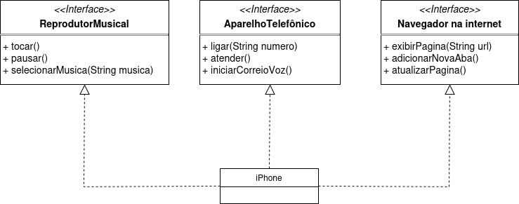

## Modelando o iPhone com UML 🎶📞🪐📲
### Visão geral
Este projeto, proposto pela [DIO](https://www.dio.me/), visa a prática dos conceitos aprendidos sobre as
**interfaces** em Java, e consiste em modelar o iPhone da Apple, lançado em 2007, que inovou ao inserir
no mercado de tecnologia um aparelho móvel que congregou as funções de reprodutor musical, aparelho telefônico e
navegador de internet.
O meio sugerido para isso é Unified Modeling Language (UML), uma das linguagens de diagramação mais usadas,
particularmente com linguagens orientadas a objetos, como Java.
### Ferramentas  🧰🪛
- [Draw.io](https://app.diagrams.net/);
- IntelliJ Idea Community Edition.
### Resultado
  

Para mais detalhes, confira o código-fonte.
